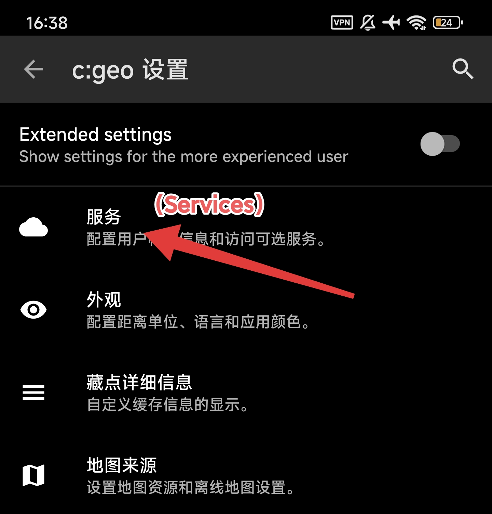
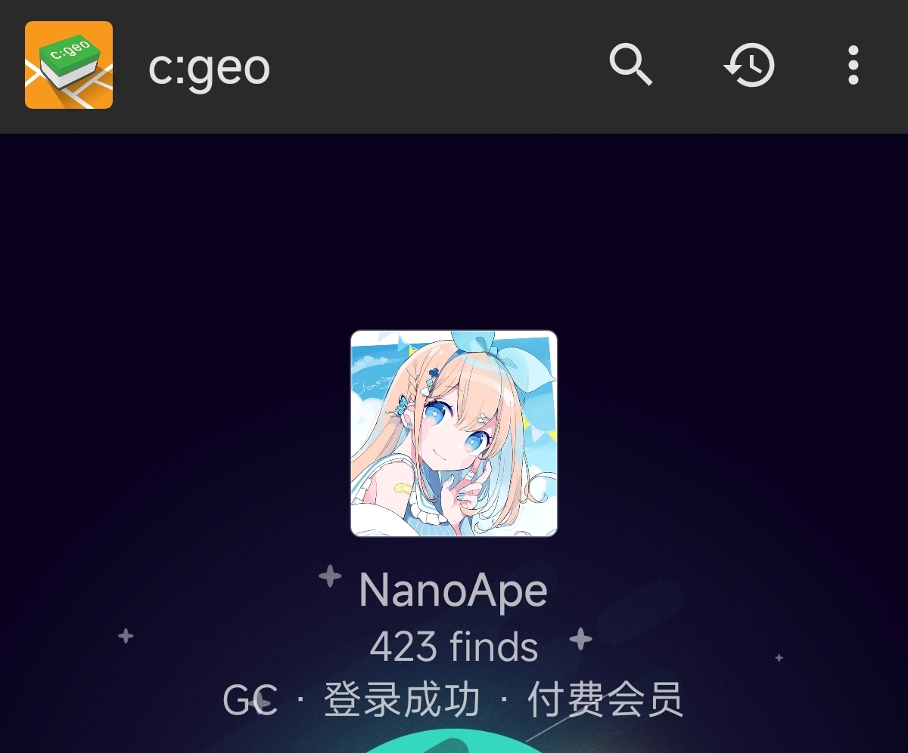
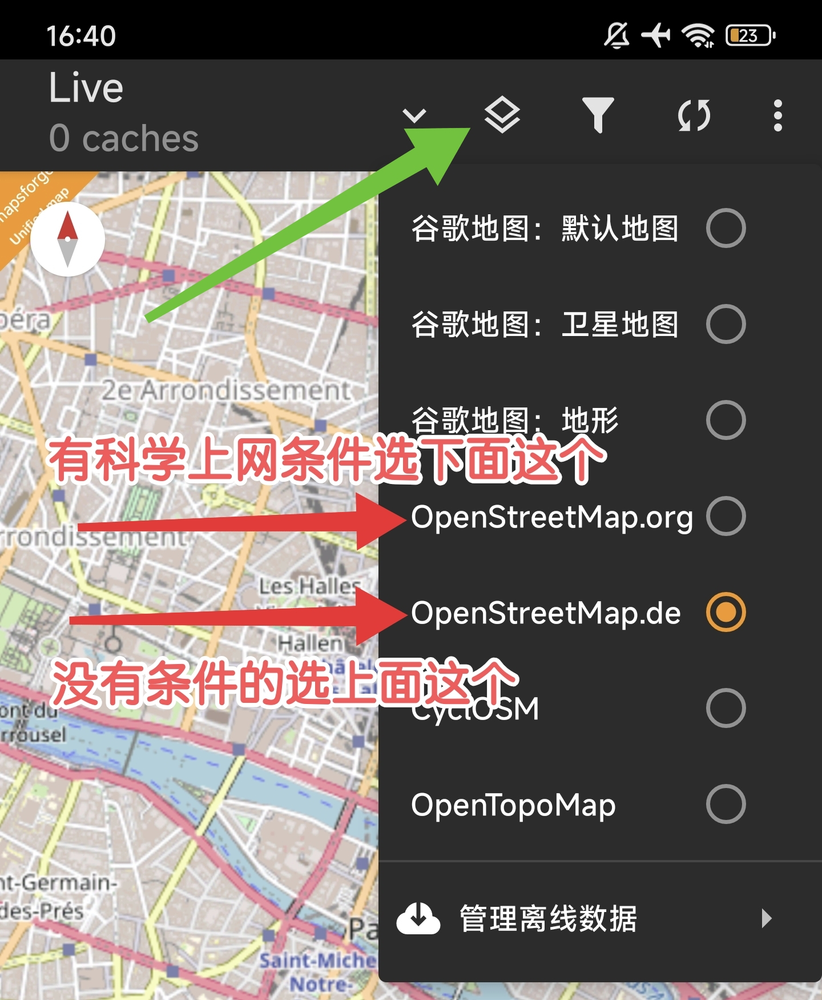

# c:geo 配置指南 { #cgeo-guide }

## 登录到 Geocaching.com { #cgeo-login }

安装后打开 c:geo，将底部导航切换到 `首页 (Home)`。点击右上角的三个点，在下拉菜单中选择 `设置 (Settings)`。

{ width="50%" }

在设置中依次点击 `服务 (Services)` → `Geocaching.com` → `激活 (Activate)` 进入登录界面，输入 Geocaching 账号和密码后点击登录。

{ width="50%" }

{ width="50%" }

{ width="50%" }

当 c:geo 首页出现类似「登录成功」的提示时，说明已经完成登录。

{ width="50%" }

## 选择地图源 { #cgeo-map-source }

登录成功后，将底部导航切换到 `地图 (Map)`。点击右上角的「切换地图」的图标，在弹出的地图列表中选择 `OpenStreetMap.de`（如果有科学上网条件，也可以选择 `OpenStreetMap.org`）。

{ width="50%" }

如果能看到下图就说明你成功啦！

{ width="50%" }

## 常见问题 { #cgeo-faq }

???+ info "我注册时是通过第三方渠道登录的，但 c:geo 只能通过账号和密码登录，怎么办？"
    这是因为 c:geo 目前只支持账号密码登录方式，而不支持第三方登录（如 Google、Apple 等）。

    如果你注册时是通过第三方渠道登录的，则需要退出登录后，通过官网的 [忘记密码](https://www.geocaching.com/account/signin/requestpassword) 功能，设置一个新的密码。
    （注：设置密码并不影响你之后继续通过第三方渠道登录）

    密码设置完成后，你就可以用新的密码登录 c:geo 了。

???+ info "登录失败，提示包含 because of wrong username/password"
    先排除输入错误，确认账号和密码正确。

    若确认无误仍失败，可能是 c:geo 版本过旧，无法兼容当前的 Geocaching 登录接口。可尝试更新 c:geo 到 [最新版本](https://g.nano.ac/https://github.com/cgeo/cgeo/releases/download/market_20260102/cgeo-release_20260102.apk)。
