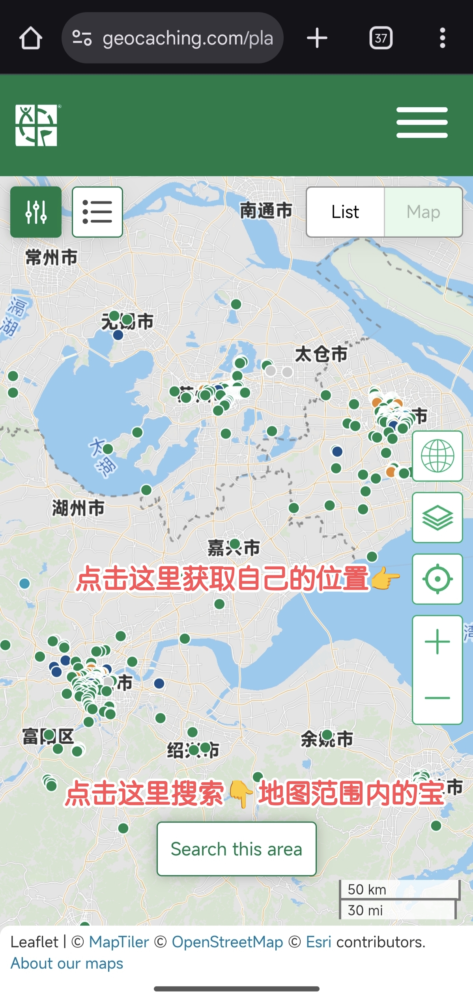

# 新手入门：如何开始 Geocaching { #how-to-start-geocaching }

## 第一步：注册账号 { #register }

首先在 [Geocaching](https://www.geocaching.com/account/join) 注册免费账号。对新手来说，普通会员的基础功能已经足够，建议先体验一段时间再考虑升级高级会员。

注册完成后，你的邮箱会收到验证邮件，点击其中的验证链接即可完成验证并可正常使用账号。

??? note "一般情况下，注册页面如下"

    <figure markdown="span">
        { width="60%" }
        <figcaption></figcaption>
    </figure>

??? info "我的注册页面和正常的不一样，怎么办？"

    如果注册页面样式异常、表单不完整（例如看不到用户名/密码输入框）、**Sign Up** 按钮灰色不可点击，或提示 **“Please solve the CAPTCHA”**，通常是因为页面资源未能完整加载。

    可以按以下顺序依次尝试：

    - **使用第三方账号登录/注册**：如果你有 Google / Apple 账号，可直接用它们注册或登录。
    - **使用 VPN**：如具备科学上网条件，开启 VPN 后刷新页面或重新打开注册链接。
    - **切换网络环境**：例如从 Wi‑Fi 切换到移动蜂窝数据（或反过来）后重试。
    - <del>实在不行，可以请有条件的朋友代为协助注册。</del>

    当完整表单和验证码都正常加载后，一般就能顺利注册。

{ width="35%" align=right }

## 第二步：在官网地图上找宝 { #geocaching-mobile-map }

注册成功后，在手机浏览器打开 Geocaching 官网并登录，然后访问 [Geocaching 地图页面](https://www.geocaching.com/play/map)。缩放和移动地图到你所在位置，即可看到附近的藏宝点（官网默认地图不存在偏移问题）。

点击地图上的藏点图标，可以查看该藏点的详细信息。

**对新手来说，直接通过手机浏览器访问官网地图会更加方便和简单，配置步骤也更少，适合完成第一次寻宝。**

## 第三步（可选）：安装手机应用 { #mobile-app }

为了更方便寻宝，你也可以安装 Geocaching 手机应用。**国内玩家建议直接使用第三方应用**，因为官方 APP 在国内存在功能限制和地图偏移的问题。

!!! note
    如果你是 Geocaching Premium 高级会员，官方 APP 也能浏览无偏移的地图，只需将图层切换到 Trails 即可。

- iPhone：推荐 [Looking4Cache Pro](https://apps.apple.com/cn/app/looking4cache-pro/id532870466)（注意不是 Looking4Cache）
    - 地图源建议 `Open Topo Map`
    - 有科学上网条件时可设为 `OpenStreetMap (Mapnik)`
    - 参考：[L4C 使用指南](https://www.geocaching.cn/2017/12/l4c-an-ios-geocaching-app-by-magic-snake/)
- Android：推荐 **c:geo**，可访问 [c:geo 官网](https://www.cgeo.org/) 或下载 [APK 安装包](https://g.nano.ac/https://github.com/cgeo/cgeo/releases/download/market_20260102/cgeo-release_20260102.apk)。配置教程见：[c:geo 使用教程](./cgeo.md)
    - 地图源建议 `OpenStreetMap.de`
    - 有科学上网条件时可设为 `OpenStreetMap.org`
    - 更多教程：[教程 1](https://www.geocaching.cn/2018/02/c-geo-in-geocaching/)、[教程 2](https://www.geocaching.cn/2023/05/first-cache-basic-cgeo-tutorial/)

这些应用能帮助你定位藏宝点、查看线索和提示。

!!! warning "中国国内地图的经纬度坐标偏移问题"
    由于国家测绘法规要求，国内所有公开地图（如高德、百度）均采用 **GCJ-02 坐标系**（俗称火星坐标），与国际通用的 **WGS-84 坐标系**存在 **300-500 米偏移**。这意味着：

    - 官方 APP 中的 Google 地图/卫星视图显示位置并不准确
    - 直接在国内地图 APP（例如高德地图、百度地图等）使用 GPS 坐标可能会产生定位偏差

    延伸阅读：
    
    - [维基百科：GCJ-02 坐标系](https://zh.wikipedia.org/wiki/%E4%B8%AD%E5%8D%8E%E4%BA%BA%E6%B0%91%E5%85%B1%E5%92%8C%E5%9B%BD%E5%9C%B0%E7%90%86%E6%95%B0%E6%8D%AE%E9%99%90%E5%88%B6#%E5%9D%90%E6%A0%87%E7%B3%BB%E5%AE%9E%E7%8E%B0)（需科学上网）
    - [简书：WGS84、GCJ-02、BD-09 都是什么？](https://www.jianshu.com/p/559029832a67) [(Internet Archive)](https://web.archive.org/web/20250325135750/https://www.jianshu.com/p/559029832a67)

## 第四步：选择一个合适的藏宝点 { #choose-cache }

每个藏宝点都有难度等级、藏宝大小、藏宝类型等信息，你可以根据自己的兴趣和能力选择一个合适的藏宝点，新手建议从低难度的藏点开始尝试。

由于国内的活跃玩家较少，部分藏宝点可能维护不及时，导致容器损坏或丢失，因此建议优先选择近期有人找到过的藏点——如果半年内的日志记录显示多人成功找到，那么这个藏点大概率还存活。

如果是第一次寻宝，还可以选择带有 Spoiler（剧透）提示的藏点（包括文字提示和图片提示），这样寻找起来会更容易。

如果附近藏点实在太少，可以考虑去大城市或热门景点寻找，比如广州、深圳、北京、上海等地藏点相对较多，而长城、故宫、天安门、上海外滩等知名景点通常也有不少藏点可供探索。

## 第五步：出发寻宝 { #go-find-cache }

当你拿到藏宝点的坐标和线索后，就可以出发了！记得带上手机（用于导航和查看线索）和一支签字笔（用来在日志本上签名）。建议穿着舒适的户外服装和鞋子，因为有些藏宝点可能需要走一段路才能到达。

到达目标地点后，请保持耐心和细心。藏宝容器可能藏在各种意想不到的地方：树洞、石缝、长椅下方，甚至是伪装成日常物品的样子。建议先观察周围环境，类似「如果我要藏东西，会选哪里？」这样的换位思考往往能帮助你更快找到目标。

如果一时找不到，不要着急，可以：

- 重新阅读藏宝描述和线索
- 查看其他寻宝者的日志记录
- 在周围扩大搜索范围
- 休息片刻后再尝试

如果实在找不到，可以在 Geocaching 上记录一条「未发现」的日志，详细描述你的寻找过程。这能帮助其他寻宝者和藏宝主人了解情况。

当你需要寻求帮助时，可以礼貌地联系最近找到这个藏宝的玩家或藏宝主人（Cache Owner，简称 CO）：

- 说明你搜索的具体位置（包括周边标志物）以便对方确认你是否在正确的地方
- 描述你已经找过哪些地方（例如：树下、石缝、长椅下等）
- 分享你的分析（比如是否觉得藏宝可能丢失）

记住，很多新手因为缺乏耐心而错过近在咫尺的藏宝。新手建议至少寻找 20-30 分钟，并尝试从藏宝者的角度思考：既要隐蔽安全，又要能经受风吹雨打，还要避免被麻瓜（指不了解 Geocaching 的路人）无意间拿走。有时候，最明显的「普通物品」可能就是精心伪装的藏宝容器！

## 第六步：找到宝藏后 { #after-find-cache }

当你找到藏宝点后，打开它，里面通常会有一个日志本和一些小物件。你可以在日志本上签上你的名字和日期，表示你找到了这个藏宝点。如果你喜欢，还可以带走一个小物件，但记得留下一个等值或更有趣的物件作为交换。

签名后，请务必把容器恢复原状，确保密封性良好，以保护里面的物品和日志本。在将容器放回原处时请确保完全恢复原状，包括它的伪装状态和具体位置，这样一是有助于下一个寻宝者找到该容器，二是避免被麻瓜发现。操作时记得留意周围环境，尽量避免引起路人的注意。

## 第七步：记录发现 { #log-cache }

回到家后，别忘了在应用或网站上记录你的发现。你可以写下你的寻宝经历、上传精彩照片，与其他藏友分享你的寻宝故事。如果在寻宝过程中拍到了精彩的照片，不妨也上传分享，但千万要注意避免剧透，有时候晒出容器的照片也算剧透。

要是发现容器有损坏或需要维护，可以在日志里特别说明，或者直接联系藏宝主人（CO）告知具体情况，这样他们就能及时修复。

作为新手，你遇到的困难和解决方法对其他新人来说都是宝贵的经验，不妨在日志中分享你的心得体会，这样其他新手玩家就能从中受益。

## 常用术语 { #glossary }

在寻宝过程中会遇到一些 Geocaching 术语和缩写，亦可参考[术语表](../glossary.md)。

- **Cache**：藏宝点或容器本身
- **CO**：Cache Owner，藏宝点的拥有者或创建者
- **DNF**：Did Not Find，表示未找到藏宝点
- **FTF**：First To Find，表示第一个找到该藏宝点的人
- **TFTC**：Thanks For The Cache，表示感谢藏宝者提供的藏宝点
- **Spoiler**：剧透，指提供的线索或提示，帮助找到藏宝点
- **Muggle**：指不了解 Geocaching 的普通人，通常是指那些可能无意中破坏藏宝点的路人
- **TB**：Travel Bug，旅行虫，一种可以在多个藏宝点之间移动的物品，通常带有追踪代码（这部分涉及到一些小众玩法，待补充……）

## 延伸阅读 { #further-reading }

- [Geocaching.cn - 地理藏宝知识文档汇总](https://www.geocaching.cn/courses/)：一个进阶向的教程，介绍了更多 Geocaching 相关的知识和技巧，包括如何制作自己的藏宝点、介绍特殊类型的藏宝点等
- [知乎 - 写给对 Geocaching 感兴趣的新玩家](https://zhuanlan.zhihu.com/p/638003725)

!!! tip
    如果你在教程中发现错误或遇到未覆盖的问题，可以在 [GitHub](https://github.com/Konano/geoguide-in-china/issues) 提问，或在 QQ 群与群友交流：953993089

    本新手教程仍在完善中，欢迎来 [GitHub](https://github.com/Konano/geoguide-in-china) 一起补充！
