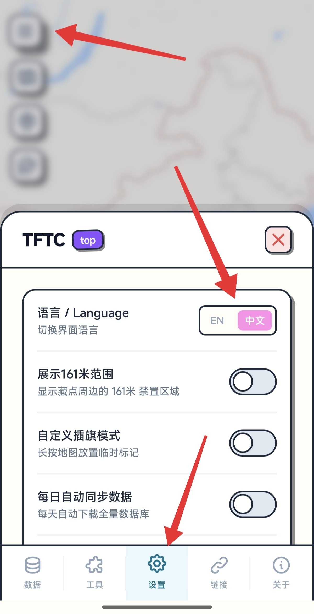
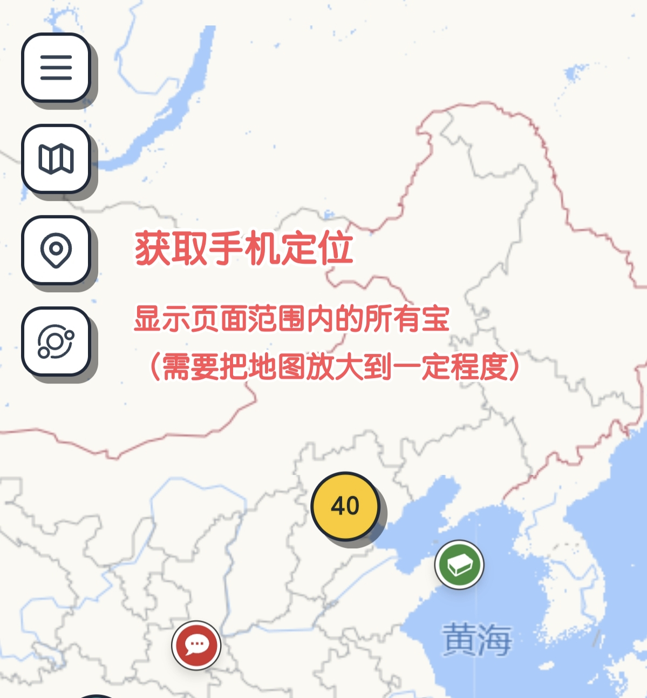
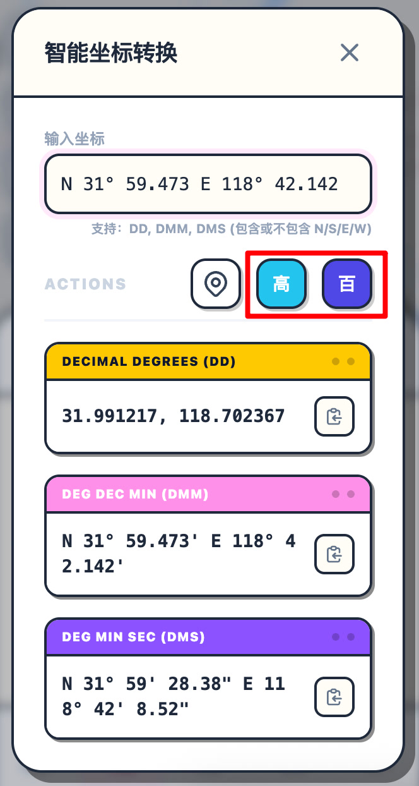

# tftc.top 使用指南 { #tftc-guide }

[tftc.top](https://tftc.top/) 是一个由热心宝友开发的第三方寻宝地图网站，提供了一个简洁易用的界面，帮助国内玩家在手机上查看附近的藏宝点信息。

默认情况下，页面只会显示最近 10 天内新增的藏宝点。

## 如何设置语言为中文 { #set-language }

在页面左上角点击三条线按钮，在菜单中找到设置项，将语言切换为中文即可。

{ width="50%" }

## 如何查看附近的藏宝点 { #view-caches }

开启页面左上角的两个按钮，然后把地图放大并移动到你所在位置附近，即可看到周边藏宝点。点击藏宝点图标可查看详细信息。

{ width="50%" }

## 如何通过经纬度定位 { #locate-by-coordinates }

在页面左上角点击三条线按钮，在菜单中找到工具，打开「智能坐标转换」功能，输入经纬度信息后会自动显示高德导航和百度地图的链接（如图红框内所示）。

!!! warning "点击链接无法跳转？"
    如果你使用的是软件内置浏览器（如微信内嵌浏览器），点击高德导航或百度地图的链接可能会无法正常跳转。此时请使用手机自带的浏览器（如 Safari、Chrome 等）打开 [tftc.top](https://tftc.top/)，并确保手机已安装对应的高德地图或百度地图 App。

{ width="50%" }
