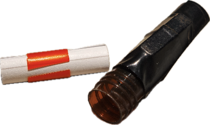

# 如何制作一个简单的容器 { #simple-container }

在 Geocaching 中，藏宝容器用于存放签到纸（logsheet）以及可能的小交换物。一个合格的容器通常需要做到：

- **防水**：保护签到纸不被雨水、冷凝水或潮气浸湿
- **耐用**：能经受户外暴晒、温差与反复取放，不易损坏
- **隐蔽**：外观低调、易于融入环境，降低被路人误拿/破坏的概率

下面分享一种**成本低、体积小、适合城市环境**的「磁吸微型容器」方案。其核心的制作思路是用带垫圈的冷冻管做本体，用磁铁实现快速吸附固定。

## 材料清单

- 1.8 ml 带垫圈棕色冷冻管
    - 重点：瓶盖内侧的**垫圈（密封圈）**能显著提升密封性与防水性

- 长方形磁铁（钕铁硼）
    - 尺寸 15 × 5 × 3 mm：常用，更小巧
    - 尺寸 30 × 5 × 3 mm：吸力更强、更稳

- 内径 14 mm 的黑色热缩管（可选但推荐）
    - 用途：把磁铁牢固固定在冷冻管外侧，外观更整洁，也更耐久
    - 缺点：需要热风枪等加热工具，操作稍微麻烦一些
    - **替代方案：黑色电工胶带 / 普通的透明胶带**

- 直径 8 mm 透明吸管（可选）
    - 用作「内胆」，帮助控制签到纸卷的直径，让取放更顺手

以上这些材料在淘宝、拼多多、1688 等平台都很容易找到，价格也不贵。

## 制作步骤

- 固定磁铁（二选一）
    - **方案 A：热缩管固定（推荐）**
        1. 剪一段热缩管，长度略长于冷冻管（一般取 35 mm 即可）
        2. 将磁铁贴在冷冻管侧面合适位置（尽量居中、贴平）
        3. 套上热缩管，调整磁铁位置保持居中
        4. 均匀加热至热缩管完全收紧，形成紧密包裹
    - **方案 B：胶带固定（快速省事）**
        1. 将磁铁贴在冷冻管侧面
        2. 用黑色电工胶带或者普通的透明胶带多圈缠绕，尽量拉紧压实，确保磁铁不移位
- 制作「内胆」（可选，但很实用）
    - 剪一小段 8 mm 透明吸管，并沿长度方向剪开（便于回弹夹住卷起来的签到纸）
    - 准备一张签到纸
        - 建议：防水纸更耐用；没有也可先用普通打印纸
        - 尺寸建议：宽度不大于冷冻管的有效深度（一般不超过 35 mm）
    - 将签到纸卷好后塞入吸管内，再一起放入冷冻管内
        - 取日志时更容易倒出/抽出，减少卡住的情况

## 成品效果

最后的成品如下图所示：

## 额外参考：更多容器 DIY 教程

在 geocaching.cn 上也有其他宝友分享的制作方案：

- [用矿泉水瓶盖制作一个微型藏点容器](https://geocaching.cn/2020/01/make-a-micro-container-with-bottle-caps/)
- [制作伪装成螺丝的藏点容器](https://geocaching.cn/2023/06/screw-cache-diy-tutorial/)
- [制作伪装成鹅卵石的藏点容器](https://geocaching.cn/2017/12/fake-rock-container-diy-by-lc1111/)
- [用松塔制作一个自然风格的藏点容器](https://geocaching.cn/2017/12/conifer-cone-container-diy-by-lc1111/)

如果你更想省事，也可以在淘宝等平台购买现成的 Geocaching 藏点容器。  
这里有一份宝友整理过的实用清单：[Geocaching 藏点容器网购关键词整理](https://geocaching.cn/2023/10/geocaching-internet-shopping-keywords-for-containers/)
